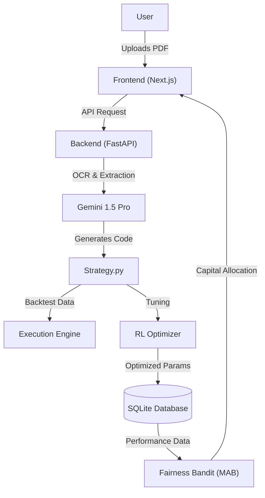

# ⚡ Alpha-Mechanism

### The Self-Evolving Hedge Fund Architecture


**Alpha-Mechanism** is an autonomous quantitative research platform that bridges the gap between academic literature and live trading. It leverages **Vision Language Models (VLMs)** to extract strategies from PDFs, **Reinforcement Learning (RL)** to tune parameters, and **Fair Multi-Armed Bandits (MAB)** to allocate capital—all wrapped in a futuristic "Cyber-Glass" dashboard.

---

## 🧠 The Core Logic

1.  **Extract:** Upload a raw research paper (PDF). The VLM reads the math and generates executable Python code.
2.  **Optimize:** An RL Agent (Hill Climbing/PPO) runs thousands of simulations to tune parameters (e.g., Stop Loss, Lookback) for the current market regime.
3.  **Battle:** Strategies compete in the "Arena" against market benchmarks (Buy & Hold).
4.  **Allocate:** A "Fairness Engine" distributes capital, balancing pure greed (profit) with exploration (fairness) using Dr. Shweta Jain's Bandit algorithms.

---

## 🏗️ Architecture



---

## ✨ Key Modules

### 🧪 **The Alpha Lab (VLM Engine)**

* **Drag & Drop Research:** Instantly turns academic PDFs into working Python `Strategy` classes.
* **Holographic Editor:** A Monaco-based editor to review and tweak AI-generated code.
* **Safe Synthesis:** Built-in syntax checking before execution.

### ⚔️ **The Battle Arena**

* **Multi-Strategy Backtesting:** Run multiple algorithms simultaneously against historical data (AAPL, BTC, etc.).
* **Benchmarking:** Automatically compares performance against a "Buy & Hold" baseline.
* **Performance Metrics:** Real-time calculation of Sharpe Ratio, Max Drawdown, and Total Return.

### 🧠 **The Hyper-Chamber (RL Tuning)**

* **Self-Optimization:** Uses a Hill-Climbing algorithm to find the mathematical "Sweet Spot" for strategy parameters.
* **Live Neural Link:** Visualizes the optimization process with real-time feedback loops and parameter radar charts via Server-Sent Events (SSE).

### ⚖️ **The Fairness Judge (MAB Console)**

* **Interactive Ethics:** A slider to toggle between **Greed** (Thompson Sampling) and **Fairness** (Constrained Exploration).
* **Regret Visualization:** Live calculation of "System Regret" (Opportunity Cost) when choosing diversity over pure profit.

---

## 🛠️ Tech Stack

### **Frontend**

* **Framework:** Next.js 14 (App Router)
* **Styling:** Tailwind CSS + Framer Motion (Glassmorphism UI)
* **Visualization:** Recharts (Interactive Financial Charts)
* **Editor:** Monaco Editor (VS Code for the browser)

### **Backend**

* **API:** FastAPI (High-performance Python)
* **Database:** SQLite + SQLAlchemy
* **Data Source:** `yfinance` (Yahoo Finance API)
* **AI Models:**
* **Extraction:** Google Gemini 1.5 Pro
* **Optimization:** Custom RL Logic / Scikit-Learn
* **Allocation:** Multi-Armed Bandit Algorithms


---

## 🚀 Quick Start

### Prerequisites

* Python 3.10+
* Node.js 18+
* Google Gemini API Key

### 1. Backend Setup

```bash
cd backend
python -m venv venv
source venv/bin/activate  # On Windows: venv\Scripts\activate
pip install -r requirements.txt

# Create .env file with your key
echo "GEMINI_API_KEY=your_actual_api_key_here" > .env

# Run Server
uvicorn main:app --reload

```

### 2. Frontend Setup

```bash
cd frontend
npm install
npm run dev

```

### 3. Access

Open your browser and navigate to `http://localhost:3000`.

---

## 📂 Project Structure

```text
alpha-mechanism/
├── backend/
│   ├── strategies/          # Generated Python strategies
│   ├── alpha.db             # SQLite Database
│   ├── main.py              # FastAPI Entry Point
│   ├── vlm_engine.py        # PDF Extraction Logic
│   ├── rl_brain.py          # Optimization Logic
│   ├── mab_logic.py         # Fairness Algorithms
│   └── ...
├── frontend/
│   ├── app/                 # Next.js Pages
│   │   ├── lab/             # Strategy Editor
│   │   ├── arena/           # Backtesting Charts
│   │   ├── brain/           # RL Visualization
│   │   └── fairness/        # MAB Console
│   └── components/          # Reusable UI Components
└── README.md

```

---

## 📜 License

Distributed under the MIT License.

---

*Built with 💻 and ☕ for the Future of Quant Finance.*
